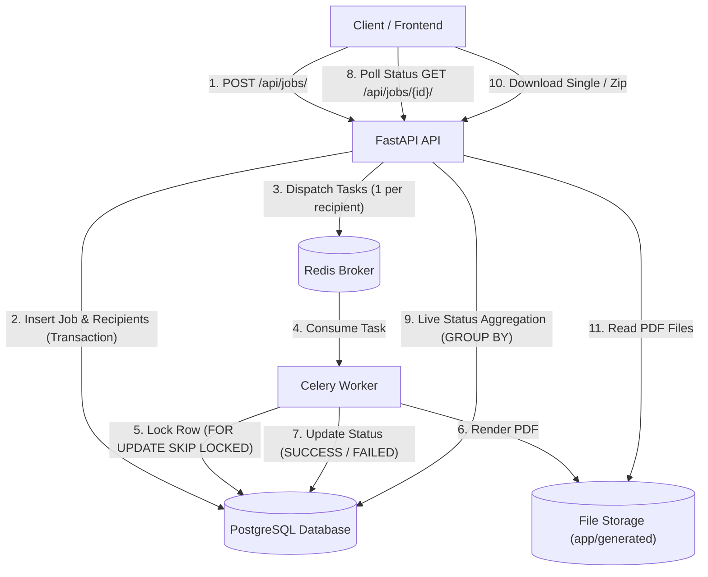
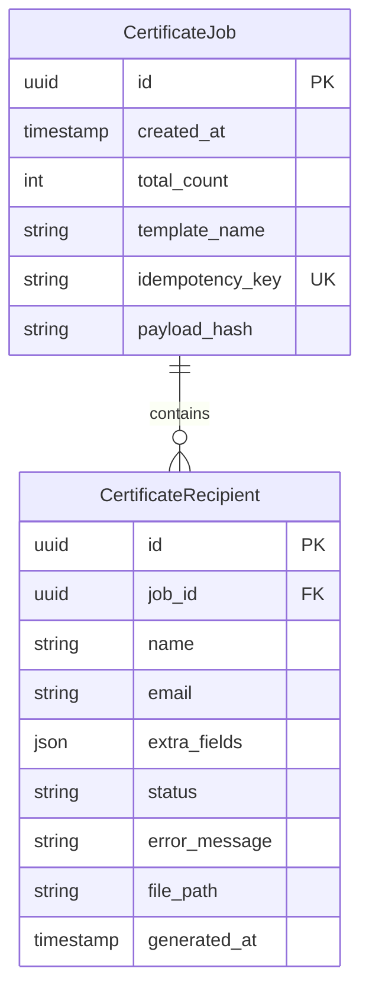

# Bulk Certificate Generator — Backend

A certificate generation backend built with FastAPI, Celery, Redis, PostgreSQL, and Pillow. It accepts batches of recipients, generates individual PDF certificates asynchronously in background workers, and provides endpoints to track processing status and download generated certificates.

---

## 1. Quick Start

### Prerequisites
- Docker and Docker Compose (v2.0+)
- Or for local non-container execution: Python 3.11+, PostgreSQL 15+, and Redis 7+

### Running with Docker Compose
```bash
# 1. Configure environment variables
cp .env.example .env

# 2. Build and start all services (api, worker, db, redis)
docker compose up --build
```

### Verified Examples (Tested against running API on `http://localhost:8000`)

#### 1. Submit a Job
```bash
curl -X POST http://localhost:8000/api/jobs/ \
  -H "Content-Type: application/json" \
  -H "Idempotency-Key: demo-batch-001" \
  -d '{
    "recipients": [
      {
        "name": "Elena Vance",
        "email": "elena@example.com",
        "extra_fields": {
          "blood_group": "O+",
          "donation_date": "2026-10-08"
        }
      },
      {
        "name": "Gordon Freeman",
        "email": "gordon@example.com",
        "extra_fields": {
          "blood_group": "A+",
          "donation_date": "2026-10-08"
        }
      }
    ],
    "template_name": "default"
  }'
```

**Response (HTTP 202 Accepted):**
```json
{
  "id": "906d8565-47d1-445d-93d6-20a521b1c427",
  "total_count": 2
}
```

#### 2. Check Job Status
```bash
curl -X GET http://localhost:8000/api/jobs/906d8565-47d1-445d-93d6-20a521b1c427/
```

**Response (HTTP 200 OK):**
```json
{
  "id": "906d8565-47d1-445d-93d6-20a521b1c427",
  "created_at": "2026-10-08T02:04:22.804341",
  "total_count": 2,
  "success_count": 2,
  "failure_count": 0,
  "pending_count": 0,
  "overall_status": "COMPLETED"
}
```

#### 3. List Job Recipients
```bash
curl -X GET http://localhost:8000/api/jobs/906d8565-47d1-445d-93d6-20a521b1c427/recipients/
```

**Response (HTTP 200 OK):**
```json
[
  {
    "id": "b8847a61-871e-4084-b7c8-edbc28d8a170",
    "name": "Elena Vance",
    "email": "elena@example.com",
    "status": "SUCCESS",
    "error_message": null,
    "generated_at": "2026-10-08T02:04:23.099816"
  },
  {
    "id": "f3d816a7-cd97-4e66-9e3f-ff132b8c4483",
    "name": "Gordon Freeman",
    "email": "gordon@example.com",
    "status": "SUCCESS",
    "error_message": null,
    "generated_at": "2026-10-08T02:04:23.101583"
  }
]
```

#### 4. Download Single Certificate PDF
```bash
curl -X GET http://localhost:8000/api/certificates/b8847a61-871e-4084-b7c8-edbc28d8a170/ \
  --output "Elena_Vance_certificate.pdf"
```

#### 5. Download Bulk Zip Archive
```bash
curl -X GET http://localhost:8000/api/jobs/906d8565-47d1-445d-93d6-20a521b1c427/certificates/download \
  --output "job_certificates.zip"
```

---

## 2. API Reference

| Method | Path | Success | Error Codes | Description |
| :--- | :--- | :--- | :--- | :--- |
| `POST` | `/api/jobs/` | `202 Accepted` | `422`, `503` | Creates a job and dispatches Celery tasks. Accepts optional `Idempotency-Key` header. Returns `422` on schema errors, batch size > 5000, or if an idempotency key is reused with a different payload. Returns `503` if broker is unreachable. |
| `GET` | `/api/jobs/{job_id}/` | `200 OK` | `404`, `422` | Returns live aggregated job progress counts and overall status (`PROCESSING`, `COMPLETED`, or `COMPLETED_WITH_ERRORS`). |
| `GET` | `/api/jobs/{job_id}/recipients/` | `200 OK` | `404`, `422` | Returns all recipient records for the job ordered alphabetically by recipient name. |
| `POST` | `/api/jobs/{job_id}/retry` | `202 Accepted` / `200 OK` | `404`, `422`, `503` | Re-enqueues non-`SUCCESS` recipients. Resets `FAILED` rows to `PENDING` and clears error messages. Returns `200` with `requeued_count: 0` if all already succeeded. |
| `GET` | `/api/certificates/{recipient_id}/` | `200 OK` | `404`, `409`, `422` | Streams the generated PDF file. Returns `409 Conflict` if generation is still pending or failed. |
| `GET` | `/api/jobs/{job_id}/certificates/download` | `200 OK` | `404`, `422` | Streams an in-memory zip archive containing all successfully generated certificate PDFs for the job. Returns `404` if no certificates succeeded. |
| `GET` | `/health` | `200 OK` | - | Health check probe returning `{"status": "ok"}`. |

*Note on status codes:* Validation failures return `422 Unprocessable Entity` rather than `400 Bad Request` following standard FastAPI and RFC 9110 convention for syntactically valid JSON payloads that fail semantic schema constraints (e.g. invalid email format, empty recipient list, batch size exceeding limit).

---

## 3. Architecture



### Component Roles
- **FastAPI API**: Validates incoming batch requests, commits job records to PostgreSQL, dispatches Celery tasks, and serves status/file queries.
- **PostgreSQL**: Stores relational job metadata, recipient statuses, error messages, and file paths. Serves as the single source of truth.
- **Redis Broker**: Holds message queues for asynchronous task distribution across background workers.
- **Celery Worker**: Executes certificate drawing via Pillow, writes PDFs to the file volume, and updates recipient records with row locking.
- **Shared Volume (`app/generated`)**: Stores generated PDF files named deterministically by recipient UUID (`{recipient_id}.pdf`).

---

## 4. Data Model



### Indexes
| Index Name | Table & Columns | Query Served |
| :--- | :--- | :--- |
| `ix_certificate_jobs_idempotency_key` | `certificate_jobs(idempotency_key)` | Enforces uniqueness and accelerates 24-hour idempotent request lookups. |
| `ix_certificate_recipients_job_id` | `certificate_recipients(job_id)` | Accelerates foreign-key joins, recipient list retrieval, and cascade deletions. |
| `ix_certificate_recipients_job_id_status` | `certificate_recipients(job_id, status)` | Powers live status aggregation (`GROUP BY status`) without table scans. |

### Binary Storage Rationale
PDF files are stored on the local file system (or shared object storage in distributed deployments) with only their file paths stored in PostgreSQL. Storing binary PDF data in database rows leads to rapid database bloat, saturates database buffer pools with static byte streams, and degrades query cache efficiency during standard metadata operations.

---

## 5. Design Decisions and Trade-offs

### 1. Celery + Redis vs. FastAPI BackgroundTasks vs. Synchronous Execution
- **Decision**: Celery backed by Redis for task execution.
- **Alternatives considered**: FastAPI in-process `BackgroundTasks`, synchronous generation in the HTTP request.
- **Why**: Synchronous generation blocks HTTP worker threads and causes client request timeouts on large batches. FastAPI `BackgroundTasks` run in the same process memory; if the API server crashes, restarts, or deploys, in-flight jobs are permanently lost. Celery provides durable queues, configurable worker concurrency, and worker lost detection.
- **Cost accepted**: Requires managing two additional runtime services (Redis and Celery worker processes) in deployment.

### 2. One Task Per Recipient vs. Monolithic Batch Task
- **Decision**: Enqueue one Celery task per recipient (`generate_certificate_task.delay(recipient_id)`).
- **Alternatives considered**: Single task processing all recipients in a job, chunked tasks (e.g. 50 recipients per task).
- **Why**: Strict failure isolation. An unhandled exception or malformed data in one recipient fails only that recipient without terminating or delaying the remainder of the batch.
- **Cost accepted**: Enqueueing 5,000 tasks creates 5,000 Redis messages per job.

### 3. Live-Computed Job Status vs. Stored Counter Columns
- **Decision**: Compute job status dynamically from recipient rows via SQL aggregation (`GROUP BY status`) on read.
- **Alternatives considered**: Incrementing/decrementing counter columns (`success_count`, `failure_count`) on the `certificate_jobs` row.
- **Why**: Having multiple concurrent workers update counter columns on the parent `certificate_jobs` table creates high row-lock contention and database deadlocks. A composite index on `(job_id, status)` allows Postgres to compute counts in single-digit milliseconds without write locks.
- **Cost accepted**: Read queries execute a `GROUP BY` aggregation rather than reading pre-computed columns from `certificate_jobs`.

### 4. Local Filesystem + DB Path vs. Database Blobs vs. Object Storage
- **Decision**: Write PDFs to local directory (`app/generated/{recipient_id}.pdf`) and record path in DB.
- **Alternatives considered**: PostgreSQL bytea columns, AWS S3 / MinIO object storage.
- **Why**: Avoids binary database bloat while keeping Docker build and local setup simple with zero cloud dependencies.
- **Cost accepted**: Requires shared volume mounts across API and worker containers; does not scale across multiple physical hosts without shared network storage (NFS/S3).

### 5. Pillow vs. ReportLab / WeasyPrint
- **Decision**: Procedural drawing using Pillow.
- **Alternatives considered**: ReportLab, WeasyPrint, Headless Chrome / Puppeteer.
- **Why**: Pillow is pure Python/C-wheel based with zero reliance on heavy external system libraries (unlike WeasyPrint which requires Cairo/Pango or Puppeteer which requires Chromium binaries).
- **Cost accepted**: When saving images as PDF, Pillow embeds a rasterized bitmap. The output text is rendered as pixels rather than selectable or searchable vector text.

### 6. Two-Tier Validation Split (Request-Level vs. Generation-Time)
- **Decision**: Reject syntactic batch errors at the API layer (422), but allow semantic data errors (e.g. blank recipient name) to pass submission and fail during generation.
- **Alternatives considered**: Pre-validating every recipient field strictly in the HTTP request schema.
- **Why**: Supports partial batch processing. If a batch of 100 donors has 1 blank name, 99 certificates generate successfully and 1 is marked `FAILED` with an error message, rather than aborting the entire submission.
- **Cost accepted**: Malformed donor names consume worker task cycles before transitioning to `FAILED`.

### 7. Idempotency Key Implementation
- **Decision**: Store `idempotency_key` with unique index and `payload_hash` (SHA-256) on `certificate_jobs`.
- **Alternatives considered**: Redis keys with TTL, client-side deduplication.
- **Why**: If a client resubmits the exact same batch within 24 hours (due to network timeout or retry), the API returns the existing job ID without duplicate work. If the same key is reused with a different payload, the API returns `422 Unprocessable Entity`. Simultaneous duplicate requests are resolved safely via unique constraint and `IntegrityError` rollback.
- **Cost accepted**: Table stores a SHA-256 hex string per idempotent job.

### 8. SQLite in Tests vs. PostgreSQL in Production Stack
- **Decision**: In-memory SQLite with `StaticPool` for the test suite; PostgreSQL in Docker Compose.
- **Alternatives considered**: Running tests against a dedicated PostgreSQL test container.
- **Why**: Tests run in under 2 seconds without requiring external running database daemons or network setup.
- **Cost accepted**: SQLite does not support row-level locks (`SELECT ... FOR UPDATE SKIP LOCKED` is a no-op in SQLite). Concurrency safety must be verified through logical tests (skipping already-generated `SUCCESS` rows) and manual Docker verification.

---

## 6. Failure Handling and Concurrency

| Scenario | What Happens | System Guarantee / Limitation |
| :--- | :--- | :--- |
| **Invalid recipient data (blank name)** | Generation raises `InvalidRecipientError`. Task logs warning, marks row `FAILED`, records error message, commits, and does not retry. | **Guaranteed**: Fails only that recipient; remaining recipients in the batch succeed. |
| **Transient generator exception** | In production, Celery catches exception, logs warning, and retries with exponential backoff (`2 ** retries` countdown, max 3 attempts). | **Guaranteed**: Transient issues retry automatically. Permanent failures mark row `FAILED` after 3 attempts. |
| **Worker crash mid-task** | Celery is configured with `task_acks_late=True` and `task_reject_on_worker_lost=True`. Redis redelivers task upon worker loss. | **Guaranteed**: Unacknowledged tasks are re-queued and processed by another worker. |
| **Duplicate task delivery or two workers on one recipient** | Worker executes `SELECT ... FOR UPDATE SKIP LOCKED`. Second worker skips locked row. If already `SUCCESS`, task exits immediately. Output filename is deterministic (`{recipient_id}.pdf`). | **Guaranteed**: Idempotent execution; no duplicate certificate generation or file corruption. |
| **Duplicate job submission within 24h** | API detects `idempotency_key`. If payload hash matches, returns existing job ID without enqueuing tasks. If payload differs, returns `422`. | **Guaranteed**: At-most-once job creation per unique batch key. |
| **Task broker down at submit time** | API catches dispatch failure, logs error, and returns `503 Service Unavailable` with `job_id`. Rows remain `PENDING` in database. | **Guaranteed**: Database transaction is preserved; client can retry dispatch via `POST /api/jobs/{job_id}/retry` once broker recovers. |
| **API process crashes between DB commit and task enqueue** | Recipient rows remain committed in PostgreSQL with `status = "PENDING"`. | **Guaranteed recovery**: Calling `POST /api/jobs/{job_id}/retry` re-enqueues all `PENDING` rows without re-creating the job. |
| **PostgreSQL unavailable** | API returns 500 error; database operations fail immediately. | **Limitation**: Database is a single point of failure without High Availability (HA) replication. |

---

## 7. Scaling to 100,000 Recipients

Analysis of the pipeline under a hypothetical 100,000 recipient workload:

| Pipeline Stage | Bottleneck & Behavior at 100k | Planned Solution | Status |
| :--- | :--- | :--- | :--- |
| **1. Request Payload Size** | A 100,000 JSON array exceeds standard HTTP body buffers and memory limits. | Enforce batch cap (5,000 max per request) and instruct client to partition requests. | **Implemented** (`MAX_RECIPIENTS_PER_JOB = 5000`) |
| **2. Database Insertion** | Inserting 100,000 rows in a single session causes high memory usage and long lock times. | Bulk insert with chunked batching (`add_all` in chunks of 1,000) or PostgreSQL `COPY FROM STDIN`. | **Partially implemented** (`add_all` in single transaction; chunked insert needed for 100k) |
| **3. In-Request Enqueue Loop** | Calling `generate_certificate_task.delay()` 100,000 times inside the HTTP handler creates 100,000 synchronous network round-trips to Redis, causing client timeouts. | Dispatch a single `fanout_job_task.delay(job_id)` background task that batches Redis pipelined pushes (`pipeline.rpush`). | **Not implemented** (Tasks currently dispatched in request loop) |
| **4. Worker Prefetch & Distribution** | Workers prefetching hundreds of tasks hoard work and starve other worker processes. | Set `worker_prefetch_multiplier = 1` and `task_acks_late = True` for single-task fair distribution. | **Implemented** |
| **5. Status Aggregation Polling** | Frequent polling of 100,000 rows puts load on database CPU. | Composite index `(job_id, status)` prevents table scans; cache aggregated counts in Redis with short TTL for active jobs. | **Implemented** (Index in place; Redis count cache not implemented) |
| **6. Recipient Listing** | `GET /api/jobs/{id}/recipients/` returning 100,000 JSON objects exhausts client and server memory. | Implement keyset pagination (`limit` and `cursor_id`). | **Not implemented** (Returns full list ordered by name) |
| **7. File Storage Across Hosts** | Generating 100,000 PDFs (~10 GB) onto a local directory cannot be accessed by API instances running on different hosts. | Stream generated PDFs directly to cloud object storage (AWS S3, GCP Cloud Storage) and store presigned URLs. | **Not implemented** (Uses local volume mount) |
| **8. Bulk Download (Zip)** | Building an in-memory zip of 100,000 PDFs in the HTTP handler will run out of memory (OOM) and time out. | Implement an asynchronous background export job that streams chunks into an S3 archive and emails a download link. | **Not implemented** (In-memory zip stream suitable for smaller batches) |
| **9. Observability** | Monitoring 100,000 task lifecycle events in logs is difficult during incidents. | Integrate Celery Flower, Prometheus metric exporter, and OpenTelemetry distributed tracing. | **Not implemented** |

---

## 8. Testing

The test suite runs against an isolated in-memory SQLite database using Celery's synchronous eager execution mode (`task_always_eager = True`). Neither PostgreSQL nor an active Redis broker is required to run tests.

### Running Tests Locally
```bash
# In your virtual environment:
pip install -r requirements.txt
pytest -v
```

### Test Coverage (26 Passing Tests)
| Test Module | Test Name | Behavior Asserted |
| :--- | :--- | :--- |
| `test_jobs.py` | `test_create_job_valid` | `POST /api/jobs/` with valid recipients returns 202 and correct `total_count`. |
| `test_jobs.py` | `test_create_job_empty_recipients_rejected` | Empty recipients list returns `422 Unprocessable Entity`. |
| `test_jobs.py` | `test_create_job_missing_required_field_rejected` | Missing required recipient name returns `422`. |
| `test_jobs.py` | `test_create_job_invalid_email_rejected` | Malformed email string returns `422`. |
| `test_jobs.py` | `test_create_job_batch_cap_exceeded_rejected` | Exceeding `MAX_RECIPIENTS_PER_JOB` returns `422` with batch split message. |
| `test_jobs.py` | `test_job_status_aggregation` | Status aggregation correctly counts success/failure and marks overall status. |
| `test_jobs.py` | `test_one_bad_recipient_does_not_block_others` | Partial failure: 3 valid + 1 blank name yields 3 `SUCCESS`, 1 `FAILED`, job `COMPLETED_WITH_ERRORS`. |
| `test_jobs.py` | `test_failure_injection_via_mocked_generator` | Mocked generator failure marks specific recipient `FAILED` with error message while others succeed. |
| `test_jobs.py` | `test_duplicate_task_execution_does_not_regenerate` | Re-running task for already `SUCCESS` recipient skips drawing (generator call count = 1). |
| `test_jobs.py` | `test_idempotent_job_submission` | Same `Idempotency-Key` within 24h returns identical job ID without creating duplicate rows. |
| `test_jobs.py` | `test_idempotent_different_key_creates_new_job` | Different idempotency keys create separate independent jobs. |
| `test_jobs.py` | `test_idempotent_key_reused_with_different_payload_returns_422` | Reusing same key with a different request payload returns `422`. |
| `test_jobs.py` | `test_broker_unavailable_at_submit_returns_503` | Broker failure during submit returns `503` with `job_id`, preserving `PENDING` rows in DB. |
| `test_jobs.py` | `test_retry_endpoint_requeues_only_non_success` | `POST /api/jobs/{id}/retry` re-enqueues only `FAILED` rows, leaving `SUCCESS` rows untouched. |
| `test_jobs.py` | `test_retry_endpoint_unknown_job_404` | Retrying a nonexistent job UUID returns `404 Not Found`. |
| `test_jobs.py` | `test_job_not_found_returns_404` | Querying nonexistent job returns `404`. |
| `test_jobs.py` | `test_malformed_job_uuid_returns_422` | Passing non-UUID string in path parameter returns `422`. |
| `test_jobs.py` | `test_recipients_list_endpoint` | Recipients list endpoint returns records ordered alphabetically by name. |
| `test_certificates.py` | `test_retrieve_generated_certificate` | `GET /api/certificates/{id}/` returns 200 with `application/pdf` binary content. |
| `test_certificates.py` | `test_retrieve_nonexistent_certificate_404` | Nonexistent certificate UUID returns `404`. |
| `test_certificates.py` | `test_retrieve_certificate_for_failed_recipient_409` | Querying certificate for failed recipient returns `409 Conflict` with failure reason. |
| `test_certificates.py` | `test_retrieve_certificate_for_pending_recipient_409` | Querying certificate for pending recipient returns `409 Conflict`. |
| `test_certificates.py` | `test_retrieve_certificate_malformed_uuid_422` | Malformed recipient UUID returns `422`. |
| `test_certificates.py` | `test_bulk_zip_download` | `GET /jobs/{id}/certificates/download` returns valid zip archive with successful certificates. |
| `test_certificates.py` | `test_bulk_zip_download_unknown_job_404` | Bulk download for nonexistent job returns `404`. |
| `test_certificates.py` | `test_bulk_zip_download_no_success_404` | Bulk download for job with 0 successful certificates returns `404`. |

### Testing Limitations
- **Celery Eager Mode**: In tests, tasks execute synchronously in-process (`task_always_eager = True`). This does not test network partitioning with Redis or Celery worker process restarts.
- **SQLite Row Locking**: SQLite does not implement `SELECT ... FOR UPDATE SKIP LOCKED`. Multi-process row-lock concurrency must be verified in Docker with PostgreSQL.

---

## 9. Configuration and Security

### Environment Variables
| Variable | Default Value | Purpose |
| :--- | :--- | :--- |
| `DATABASE_URL` | `postgresql://postgres:postgres@db:5432/certgen` | PostgreSQL connection string. |
| `REDIS_URL` | `redis://redis:6379/0` | Redis broker and result backend URL. |
| `GENERATED_DIR` | `app/generated` | Filesystem directory where generated PDFs are stored. |
| `TEMPLATES_DIR` | `app/templates` | Filesystem directory for template assets. |
| `CELERY_ALWAYS_EAGER` | `false` | When `true`, executes Celery tasks synchronously in-process (used for tests). |
| `MAX_RECIPIENTS_PER_JOB` | `5000` | Maximum allowed recipients in a single submission batch. |
| `CORS_ORIGINS` | `["http://localhost:5173"]` | Allowed CORS origins for browser clients. |

### Development vs. Production Compose
- The base `docker-compose.yml` runs production commands without debug flags or live reload.
- Development overrides (`--reload` flag and `./app:/code/app` source bind-mounts) are isolated in `docker-compose.override.yml`, which Docker Compose automatically merges during local development.

### Security Implementation & Limitations
- **Output Filename Isolation**: Certificate files on disk derive strictly from generated UUIDs (`{recipient_id}.pdf`). User-submitted donor names are never used in filesystem paths, preventing directory traversal vulnerabilities.
- **Not Implemented**: API key authentication, OAuth2 tokens, and per-IP submission rate limiting are currently not implemented.

---

## 10. Known Limitations and Next Steps

1. **In-Request Task Enqueueing**:
   - *Impact*: Enqueueing batches above 5,000 items in the HTTP request handler introduces latency.
   - *Next Step*: Replace request-level loop with a Celery fan-out dispatcher task (see Section 7, Stage 3).

2. **Single-Host Volume Storage**:
   - *Impact*: Local PDF storage requires API and workers to share a local volume mount.
   - *Next Step*: Migrate file persistence to S3/GCS bucket storage with presigned download URLs (see Section 5.4 and Section 7, Stage 7).

3. **Unpaginated Recipient Listing**:
   - *Impact*: Retrieving all recipients for massive batches returns unbounded JSON arrays.
   - *Next Step*: Add keyset pagination (`limit` and `cursor_id`) to `GET /api/jobs/{id}/recipients/` (see Section 7, Stage 6).

4. **Synchronous Bulk Zip Creation**:
   - *Impact*: Bundling large numbers of PDFs into a zip buffer during an HTTP request consumes server memory.
   - *Next Step*: Move bulk zip creation to a background task that streams the archive to storage and provides a download URL (see Section 7, Stage 8).

5. **Authentication & Rate Limiting**:
   - *Impact*: The submission API is unauthenticated and open to queue flooding.
   - *Next Step*: Add token-based authentication and rate limiting headers (see Section 9).
